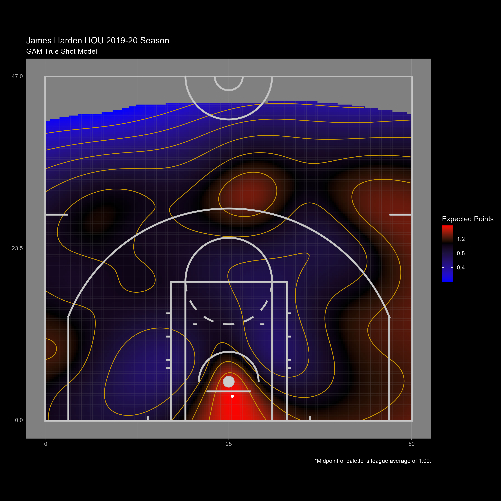
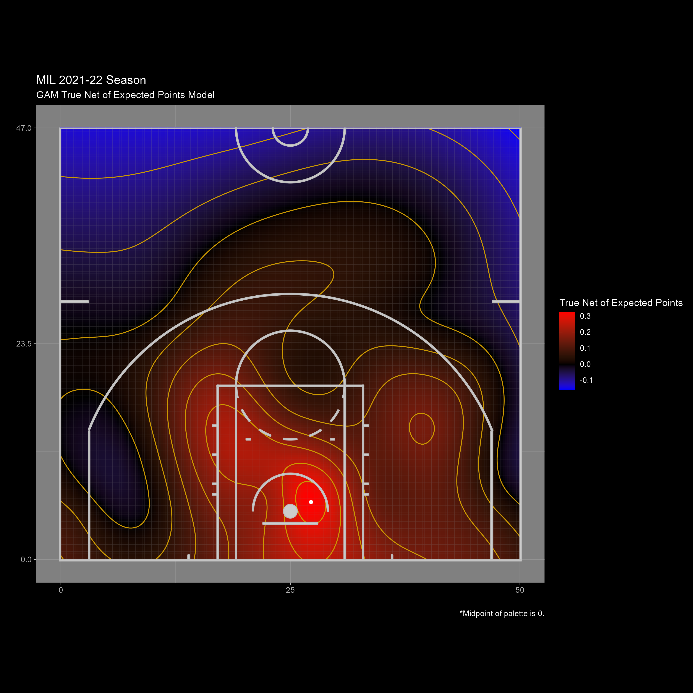

# Estimating NBA Team Shot Selection Efficiency from Aggregations of True, Continuous Shot Charts: A Generalized Additive Model Approach
## [Justin Ehrlich](https://falk.syr.edu/people/ehrlich-justin/) and [Shane Sanders](https://falk.syr.edu/people/sandersshane/)
### https://sportdataviz.syr.edu/TrueShotChart/
\
\
This project renders a basketball shot chart that uses a generalized additive model to estimate total shot proficiency continuously in the half-court. This shot chart incorporates missed shots that draw a shooting foul, and shot-pursuant free throw scoring, to determine total or true scoring yield following a shot decision. A traditional discrete, or binned, shot chart is a size- and color-coded spatial plot that tracks both location-dependent volume and points yielded from the floor, respectively, on field goal attempts (FGAs). Shot charts provide distilled summaries of shot-distributional efficiency and are therefore a leading analytic tool for team game-planning (see, e.g., Papalexakis and Pelechrinis 2018; Jiao, Hu, and Yan 2021; Jieying, Guanyu, and Jun 2021; Franks, Miller, Bornn, and Goldsberry 2015; Fichman and O’Brien 2019; Skinner and Goldman 2015; Goldman and Rao 2011; Narayan 2019; Winston, Nestler, and Pelechrinis 2022). While descriptive, traditional shot charts do not account for free throw scoring pursuant to shots from the field, nor the locations of those shots from the field that lead to the free throw scoring opportunities. By considering missed shots that result in a shooting foul, which are not considered FGAs, and made shots that result in an “and-one” free throw opportunity, we correct for location-conditional scoring yield estimate distortions in traditional shot charts.\
\
Below we consider James Harden’s 2019-20 shot chart. We chose this player-season for several reasons. This was Harden’s last year in Houston, where he was the on-court leader of a revolution in shot chart reductionism, Daryl Morey having been the accompanying front office leader of said revolution. Further, Harden won his third consecutive scoring title that season. Lastly, Harden has an exceptionally high free throw rate such that we expect a great deal of additional information in his true shot chart. In that season, Harden’s FT rate (FTA/FGA) was 0.557 or about 2.14 times the league average of 0.26.\

\
This code can also produce differential shot charts. For the 2021-22 Bucks, the below differential shot chart visualizes the difference, from each point in the half court, between the color coding, or yield, of the Continuous True Shot Chart and that of a conventional shot chart that does not include shot-pursuant FT scoring. We observe from the differential shot chart that failing to include shot-pursuant FT scoring places a substantial, and typically downward, bias on the estimated yield of shots near the basket. In general, the differential is variable across the floor, suggesting a variable underlying shot position conditional FT rate. Thus, traditional shot charts can substantially distort spatial characterizations of scoring yield. These same results bear out for many other team seasons, as can be observed on our custom shot chart dashboard at https://sportdataviz.syr.edu/TrueShotChart/. The differential shot chart also explains the unexpected result that, in a true shot chart, shots from the left baseline extended long 2PA region generated a high yield for the 2021-22 Bucks. Shots from this region generated a high made FT rate. It can be observed on the dashboard that James Harden’s 2019-20 yield premium from this region also partly depended on a relatively high made FT rate for shots in that region.\

\
\
`analysis_v3.Rmd`: Script to analyze play-by-play data\
`gam_shot_charts_parallel`: Script to create the shot charts\
`ShotEfficiencyGam.Rmd`: Script to validate the shot selection metric\
`app.R`: Script for interactive Shiny dashboard\
`data_clean.ipynb`: Script for prepping the PbP data.
`lib/`: Libraries for above scripts\
`data/`: Data location of cleaned data\
`rawData/`: Data location of raw play-by-play data\
`images/`: Example True Shot Charts
